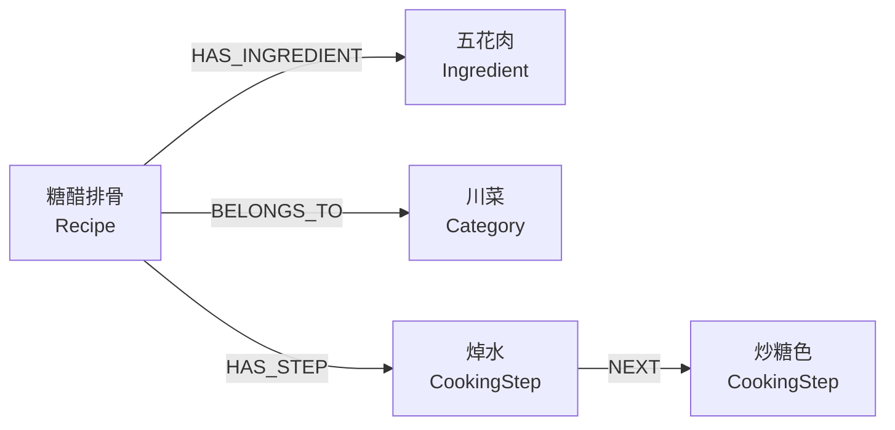
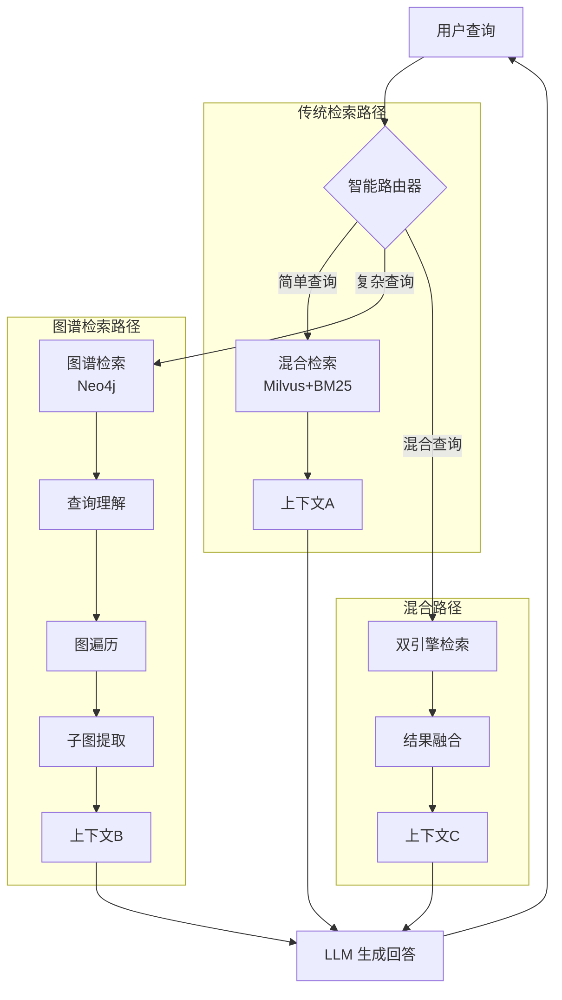
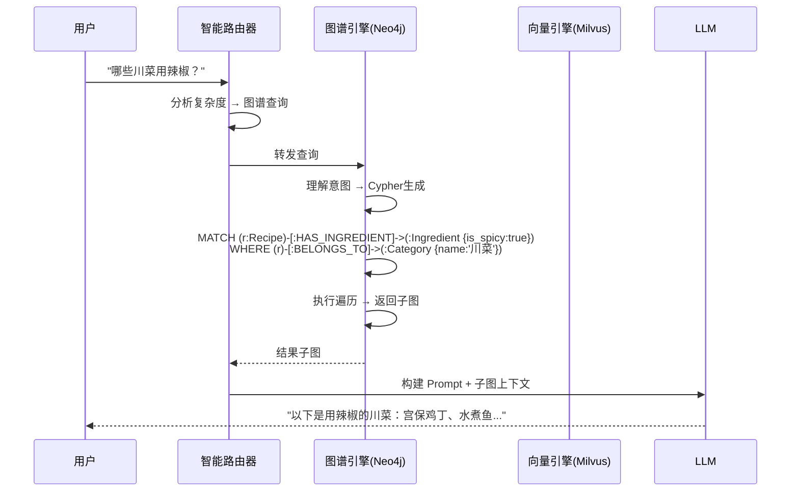

# C9 GraphRAG 系统完全指南：从入门到精通

> **目标读者**：已经掌握 C1-C8 基础，想要理解并基于 C9 构建自己项目的开发者

---

## 📚 目录
1. [GraphRAG 是什么？](#1-graphrag-是什么)
2. [C9 vs C8：为什么需要图谱？](#2-c9-vs-c8为什么需要图谱)
3. [核心概念速览](#3-核心概念速览)
4. [C9 系统架构](#4-c9-系统架构)
5. [数据流详解](#5-数据流详解)
6. [模块深度剖析](#6-模块深度剖析)
7. [实战：运行 C9](#7-实战运行-c9)

---

## 1. GraphRAG 是什么？

### 传统 RAG 的局限性（C8 的痛点）

假设你问 C8："哪些菜既用了辣椒，又需要烤箱，而且是川菜？"

C8 会这样处理：
1. 把问题变成向量
2. 在向量库里搜"辣椒 + 烤箱 + 川菜"
3. 找到几篇相似文档
4. 让 LLM 从文档里提取答案

**问题来了**：
- ❌ 如果"辣椒"在一段，"烤箱"在另一段，C8 可能搜不全
- ❌ "是川菜"这个属性可能藏在文档深处，元数据过滤也不一定有
- ❌ 多个条件的 **组合查询** 对向量检索来说很难

### GraphRAG 的解决方案

GraphRAG 把知识**结构化**成图谱：

```
[糖醋排骨] --需要食材--> [五花肉]
[糖醋排骨] --属于菜系--> [川菜]
[糖醋排骨] --烹饪工具--> [炒锅]
```

现在问"哪些川菜需要五花肉？"，系统直接在图上遍历：
1. 找到所有 `--属于菜系--> [川菜]` 的节点
2. 再过滤出 `--需要食材--> [五花肉]` 的节点
3. 精准返回结果

**核心优势**：
- ✅ **多跳推理**：能回答"这道菜的食材里，哪些是川菜常用的？"
- ✅ **关系查询**：能回答"回锅肉和鱼香肉丝有什么共同食材？"
- ✅ **全局理解**：能回答"总结一下川菜的特点"（提取川菜子图）

---

## 2. C9 vs C8：为什么需要图谱？

| 维度 | C8 (传统 RAG) | C9 (GraphRAG) |
|------|--------------|--------------|
| **数据结构** | 文本块 + 元数据 | 图谱节点 + 关系 + 文本 |
| **检索方式** | 向量相似度 + 关键词 | 图遍历 + 向量检索 |
| **适合查询** | "糖醋排骨怎么做？" | "哪些菜用辣椒但不是川菜？" |
| **多跳推理** | ❌ 不支持 | ✅ 支持 |
| **关系查询** | ❌ 很弱 | ✅ 核心能力 |
| **数据准备** | 简单（切分+Embedding） | 复杂（需要实体抽取+关系建模） |

### 实际例子对比

**查询**："推荐既辣又适合新手的川菜"

**C8 的处理**：
```
1. 提取关键词：辣、新手、川菜
2. 元数据过滤：category=川菜, difficulty=简单
3. 向量搜索"辣"
4. 返回结果
```
**问题**：如果"辣"这个特征没被提取成元数据，就搜不到。

**C9 的处理**：
```cypher
MATCH (dish:Recipe)-[:BELONGS_TO]->(category:Category {name: '川菜'})
WHERE dish.difficulty = '简单' 
  AND EXISTS((dish)-[:HAS_INGREDIENT]->(:Ingredient {is_spicy: true}))
RETURN dish
```
**优势**：精准查询图谱中的实体关系，100% 准确。

---

## 3. 核心概念速览

### 3.1 知识图谱 (Knowledge Graph)
由**节点**（实体）和**边**（关系）组成的网络：



### 3.2 Neo4j 图数据库
C9 使用 **Neo4j** 存储图谱：
- **节点标签**：`Recipe`（菜谱）、`Ingredient`（食材）、`Category`（分类）
- **关系类型**：`HAS_INGREDIENT`、`BELONGS_TO`、`HAS_STEP`
- **查询语言**：Cypher（类似 SQL，但专门查图）

### 3.3 Cypher 查询语言

**示例 1：查找所有川菜**
```cypher
MATCH (r:Recipe)-[:BELONGS_TO]->(c:Category {name: '川菜'})
RETURN r.name
```

**示例 2：找出两道菜的共同食材**
```cypher
MATCH (r1:Recipe {name: '回锅肉'})-[:HAS_INGREDIENT]->(i:Ingredient)<-[:HAS_INGREDIENT]-(r2:Recipe {name: '鱼香肉丝'})
RETURN i.name
```

### 3.4 Milvus 向量数据库
C9 同时使用 **Milvus** 存储文本向量：
- 用于传统的**语义搜索**
- 与 Neo4j 图谱形成**双引擎架构**

---

## 4. C9 系统架构

### 整体架构图



### 双引擎架构

C9 的核心是**双引擎**：
1. **传统引擎**：Milvus (向量) + BM25 (关键词)
2. **图谱引擎**：Neo4j (图遍历) + Cypher (结构化查询)

**智能路由器** 根据查询复杂度选择引擎：
- 简单："今天吃什么？" → 传统引擎
- 复杂："哪些菜用辣椒但不用酱油？" → 图谱引擎
- 混合："推荐川菜，最好是辣的" → 双引擎

---

## 5. 数据流详解

### 流程图：从查询到回答



### 关键步骤解析

**步骤 1：查询理解 (Intent Analysis)**
- 输入："哪些川菜用辣椒？"
- 输出：
  ```json
  {
    "query_type": "multi_hop",
    "entities": ["川菜", "辣椒"],
    "relations": ["BELONGS_TO", "HAS_INGREDIENT"],
    "constraints": ["category='川菜'", "ingredient.is_spicy=true"]
  }
  ```

**步骤 2：Cypher 生成**
- 根据理解结果，自动生成图查询语句

**步骤 3：图遍历**
- Neo4j 执行 Cypher，在图上找路径

**步骤 4：子图提取**
- 把相关节点和关系打包成"知识子图"

**步骤 5：LLM 生成**
- 用子图作为上下文，生成自然语言回答

---

## 6. 模块深度剖析

### 6.1 数据准备模块 (`graph_data_preparation.py`)

**职责**：把 Markdown 菜谱变成 Neo4j 图谱

**关键方法**：
```python
def build_knowledge_graph(self, documents):
    """
    1. 调用 AI Agent 解析 Markdown
    2. 提取实体（菜名、食材、步骤）
    3. 提取关系（菜->食材、菜->分类）
    4. 插入 Neo4j
    """
```

**数据模型**：
- **节点类型**：`Recipe`, `Ingredient`, `CookingStep`, `Category`
- **关系类型**：`HAS_INGREDIENT`, `HAS_STEP`, `BELONGS_TO`, `NEXT`

### 6.2 图谱检索模块 (`graph_rag_retrieval.py`)

**职责**：核心 GraphRAG 逻辑

**核心方法**：

**1. `understand_graph_query()`**
- 用 LLM 理解用户查询
- 提取实体、关系、约束

**2. `multi_hop_traversal()`**
- 执行多跳遍历
- 示例：找"这道菜的食材中，哪些也被其他川菜使用？"

**3. `extract_knowledge_subgraph()`**
- 提取相关子图
- 返回序列化的图结构

### 6.3 智能路由模块 (`intelligent_query_router.py`)

**职责**：分析查询复杂度，选择检索策略

**复杂度评分规则**：
```python
def analyze_complexity(query):
    score = 0
    if "哪些" in query or "推荐" in query: score += 2
    if "不是" in query or "除了" in query: score += 3  # 否定查询
    if "共同" in query or "都有" in query: score += 4  # 多实体关系
    return "graph" if score >= 5 else "traditional"
```

### 6.4 AI Agent (`agent/recipe_ai_agent.py`)

**职责**：用 LLM 解析非结构化菜谱，生成结构化数据

**示例输入（Markdown）**：
```markdown
# 糖醋排骨
难度：★★★★★
## 食材
- 排骨 300g
- 白糖 30g
```

**示例输出（JSON）**：
```json
{
  "dish_name": "糖醋排骨",
  "difficulty": 5,
  "ingredients": [
    {"name": "排骨", "amount": "300g"},
    {"name": "白糖", "amount": "30g"}
  ]
}
```

---

## 7. 实战：运行 C9

### 前置要求

1. **安装 Neo4j**
   ```bash
   # macOS
   brew install neo4j
   neo4j start
   ```

2. **安装 Milvus**
   ```bash
   docker run -d --name milvus \
     -p 19530:19530 \
     milvusdb/milvus:latest
   ```

3. **配置环境变量**
   ```bash
   # .env
   NEO4J_URI=bolt://localhost:7687
   NEO4J_USER=neo4j
   NEO4J_PASSWORD=your_password
   MILVUS_HOST=localhost
   MILVUS_PORT=19530
   GOOGLE_API_KEY=your_gemini_key
   ```

### 运行步骤

```bash
cd code/C9
pip install -r requirements.txt
python main.py
```

### 测试查询

**1. 简单查询（走传统引擎）**
```
问: 糖醋排骨怎么做？
→ 使用 Milvus 向量检索
```

**2. 复杂查询（走图谱引擎）**
```
问: 哪些菜既用辣椒又用花椒？
→ 使用 Neo4j 图遍历
```

**3. 混合查询（双引擎）**
```
问: 推荐辣的川菜，最好是简单的
→ Neo4j 过滤分类，Milvus 排序推荐
```

---

## 🎯 总结：C9 的本质

C9 = **C8 的扩展版**，但加入了**结构化推理能力**：

| 能力 | C8 | C9 |
|------|----|----|
| 语义搜索 | ✅ | ✅ |
| 元数据过滤 | ✅ | ✅ |
| 多跳推理 | ❌ | ✅ |
| 关系查询 | ❌ | ✅ |
| 全局分析 | ❌ | ✅ |

**使用建议**：
- 如果你的数据关系不复杂 → 用 C8
- 如果需要"谁和谁有什么关系"这类查询 → 用 C9
- 如果数据天然就是图（社交网络、供应链） → 必须用 C9

**下一步**：建议先阅读 `rag_modules/graph_rag_retrieval.py` 的代码，理解 Cypher 是如何生成的。
